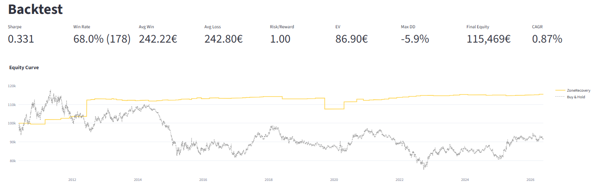
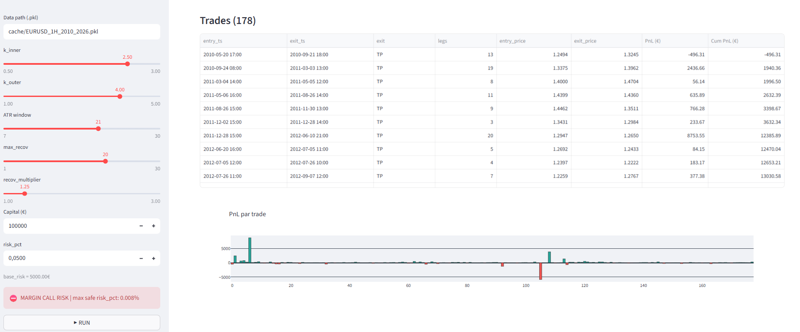

# Recovery Backtesting Pipeline

Pipeline de backtesting pour une stratégie **Zone Recovery** sur EUR/USD 1H.

## Ce que ça fait

- Détecte les niveaux ATR dynamiques (tunnels intérieur/extérieur)
- Gère une martingale inversée avec max recovery configurable
- Backtest : exécution au next open, position sizing, capital dynamique
- Walk-Forward sur 16 ans de data (2010-2026)
- UI interactive via Streamlit

## Apps disponibles

| App | Description |
|-----|-------------|
| `app.py` | Backtest + métriques |

## Params configurables

`k_inner`, `k_outer`, `ATR_window`, `max_recov`, `recov_multiplier`, `capital`, `risk_pct`

```
k_inner : distance inner band (entry zone) en multiple ATR
k_outer : distance outer band (TP zone) en multiple ATR
ATR_window : période de calcul de l'ATR
max_recov : nombre max de recoveries avant SL forcé
recov_multiplier : facteur de la martingale (ex: 1.5 = x1.5 à chaque recovery)
capital : capital initial en €
risk_pct : % du capital risqué par trade initial
```

## Métriques

Sharpe, CAGR, Max Drawdown, Calmar, Win Rate, RRR, EV, n_sl_max_recov

## Stack

Python · Streamlit · Plotly · Pandas

## Screenshots



